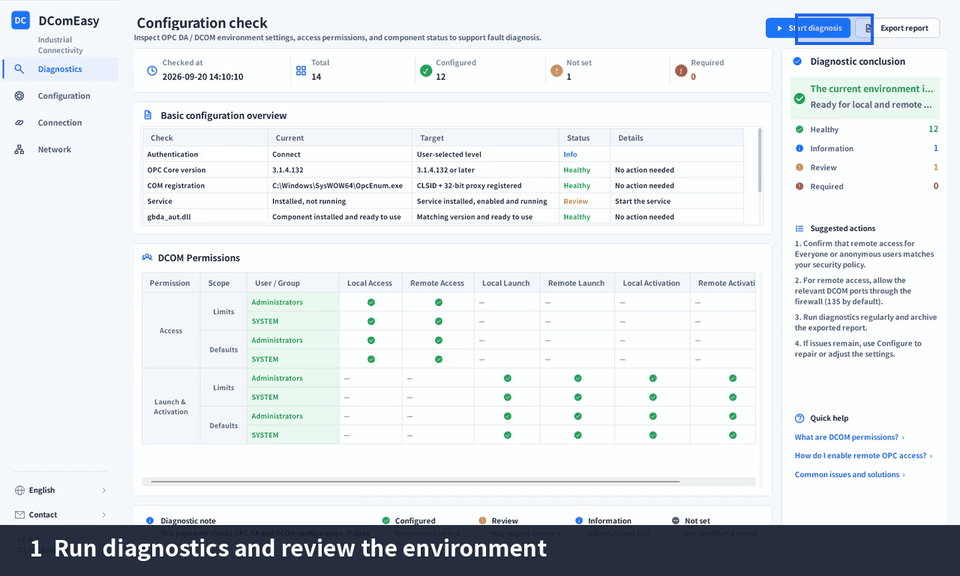

# DComEasy


<p align="center">
  <a href="README.md">简体中文</a> · <strong>English</strong>
</p>

<p align="center">
  <a href="https://github.com/Todayos/DComEasy-Releases/releases/latest"><strong>Download the latest release</strong></a>
  · <a href="docs/usage.en.md">User guide</a>
  · <a href="https://github.com/Todayos/DComEasy-Releases/issues">Issue tracker</a>
</p>

DComEasy is a Windows OPC DA / DCOM configuration and diagnostic tool for industrial deployment, commissioning, and maintenance. It brings environment diagnostics, DCOM permission configuration, OPC DA connection testing, point monitoring, network checks, and diagnostic reports into one interface.

> [!IMPORTANT]
> DComEasy is proprietary software. This repository hosts official releases, user documentation, and issue tracking. It does not contain the product source code. By downloading or using the software, you agree to the license terms included with the release package.

## See it in action

Start with diagnostics, review licensing and edition features, validate or create the OPC user, preview and apply configuration, then test the connection, read items, and enable batch polling. The demo uses sample data and contains no real account, activation code, or server information.

<p align="center">
  
</p>

## Features

-  **Configuration diagnosis**: inspect local settings, the application user, DCOM role permissions, OPC components, and registration status.
-  **User management**: validate or create a local OPC user without overwriting or resetting an existing user's password.
-  **Configuration management**: adjust DCOM permissions, the default authentication level, and protocol order; preview changes independently, then apply them after confirmation.
-  **Component deployment**: install or repair the OPC runtime environment as needed and ensure OPCEnum and the automation components are available.
-  **Connection testing**: test directly without running diagnosis or applying configuration first. Supports ProgID / CLSID and reports network checks, failure stages, error codes, and original errors.
-  **Browsing and monitoring**: expand branches on demand, query full ItemIDs, read once, or set individual and batch polling intervals; inspect values, quality, timestamps, and read errors.
-  **Connection history**: retain successful and failed attempts, restore recent target inputs after restart, and restore or delete records from the context menu without losing the scroll position. Passwords are excluded.
-  **Network tools**: remote checks show target connectivity only; local checks also show local listeners and firewall rules. Add local inbound TCP / UDP port rules in batches.
-  **Diagnostic reports**: export PDF or HTML for troubleshooting, handover, and archiving.
-  **Bilingual interface**: switch between Simplified Chinese and English in the sidebar; the application remembers your selection.

## Offline licensing

The client always uses offline licensing and does not require a website or an internet connection at the deployment site. Licensing is mandatory in every official release. An unactivated installation runs as the Free edition; a valid activation code enables the features assigned to Pro or Enterprise.

| Edition | Activation | Current feature scope |
|---|---|---|
| Free | No code; the default client state | Diagnostics, user validation, change preview, basic OPC connection/browsing/single reads, network status checks, history, and logs; PDF reports include a Free watermark |
| Pro | 32-character Pro activation code | All features, with watermark-free PDF and HTML reports |
| Enterprise | 32-character Enterprise activation code | Currently the same as Pro, but backed by a separate entitlement set for future differentiation |

An activation code contains eight groups of four characters and carries the edition, a unique license ID, a first-activation deadline, an optional usage expiry date, and an application-identity digest. The first-activation deadline restricts only activation on new devices; an activated device continues to use the separate usage-expiry rule.

## Requirements

- Supports 64-bit Windows. DComEasy runs as a 32-bit process for compatibility with OPC DA and related COM components.
- Administrator privileges to install and run DComEasy.
- The complete offline installer, which includes the required .NET runtime.
- A reachable OPC DA server and valid OPC user credentials for connection testing.

## Download and installation

1. Download the latest `DComEasy-Setup-v2.0.0.exe` from [Releases](https://github.com/Todayos/DComEasy-Releases/releases).
2. Run the installer as an administrator.
3. Start DComEasy from the Start menu and run it with administrator privileges when prompted.

To install a newer release, close DComEasy and run the newer installer as an administrator without uninstalling first. The directory page defaults to the current installation; keep it for an in-place upgrade or choose another empty directory. License state, logs, connection history, and user-owned files are preserved.

Use installers published through this repository's GitHub Releases. Do not download installers from unknown sources or copy only the application executable from an installation directory.

After downloading, verify the installer's integrity in PowerShell:

```powershell
Get-FileHash .\DComEasy-Setup-v2.0.0.exe -Algorithm SHA256
```

The current official installer should produce:

```text
4b968bfab03ea6c45d2fe4c1331e138e623a0f36d3dab076015915b5cc498a72
```

Publishing a SHA-256 checksum does not expose source code, licensing keys, or the activation-code generation method. It only helps confirm that a file was not damaged or replaced. A checksum alone does not authenticate the publisher: if both the installer and published checksum are replaced, the comparison can still pass. Download only from this repository's official Releases. Rebuilding an installer changes its checksum, so use the value published for the corresponding release.

See the [user guide](docs/usage.en.md) for detailed instructions.

## Feedback

Search the [existing issues](https://github.com/Todayos/DComEasy-Releases/issues) before opening a new one. If no matching issue exists, use one of the templates:

- [Report a bug](https://github.com/Todayos/DComEasy-Releases/issues/new?template=bug_report.yml)
- [Request a feature](https://github.com/Todayos/DComEasy-Releases/issues/new?template=feature_request.yml)

Include the DComEasy version, Windows version, reproduction steps, expected result, and actual result. Remove account names, host names, IP addresses, and other sensitive information from screenshots and logs. Never submit passwords.

## Copyright and license

Copyright © 2026 Todayos. All rights reserved.

DComEasy is proprietary software. Every official release uses offline licensing. An unactivated installation provides only the Free edition's basic features; Pro and Enterprise features require a valid activation code. Public access to this repository does not grant source modification, resale, or redistribution rights. The license terms included with each release package govern use of the software. Third-party components remain subject to their respective licenses.
