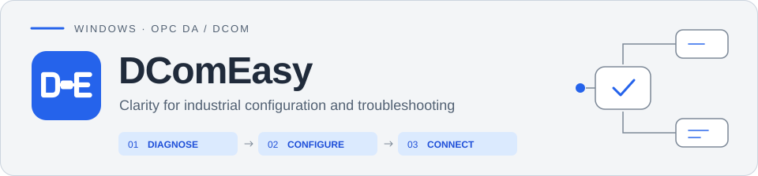
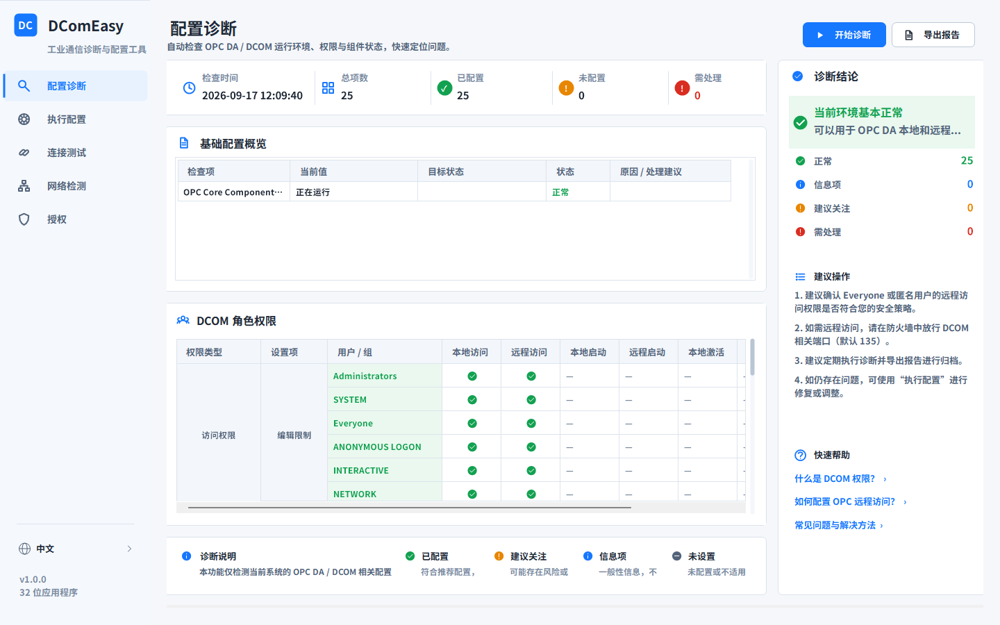
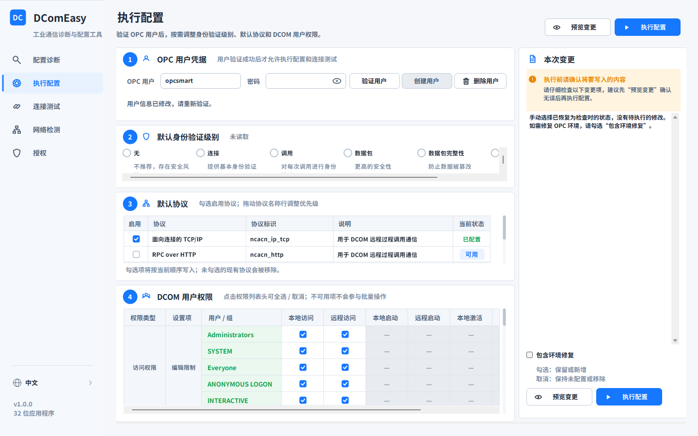
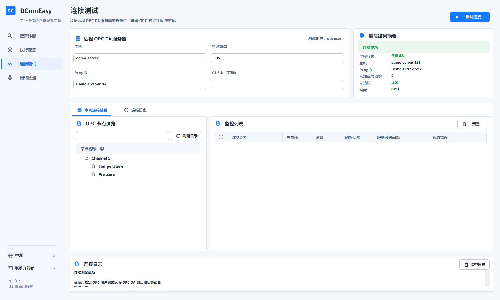
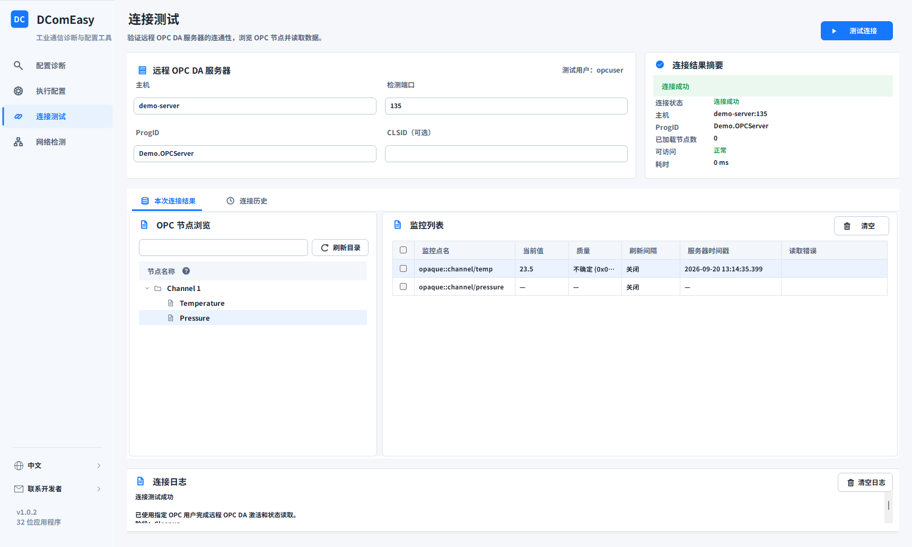
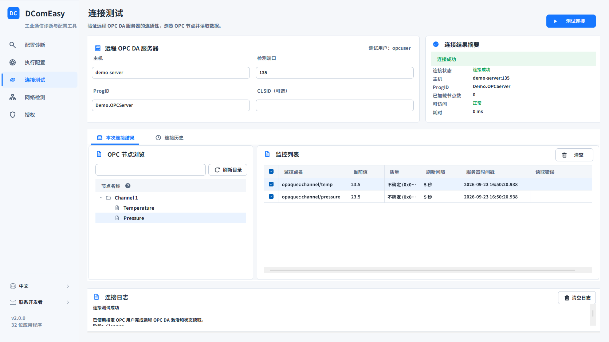

# DComEasy

  <a href="README.md">简体中文</a> · <strong>English</strong>

  <a href="https://github.com/Todayos/DComEasy-Releases/releases/latest"><strong>Download the latest release</strong></a>
  · <a href="docs/usage.en.md">User guide</a>
  · <a href="https://github.com/Todayos/DComEasy-Releases/issues">Issue tracker</a>

DComEasy is a Windows OPC DA / DCOM configuration and diagnostic tool for industrial deployment, commissioning, and maintenance. It brings environment diagnostics, DCOM permission configuration, OPC DA connection testing, point monitoring, network checks, and diagnostic reports into one interface.

> [!IMPORTANT]
> DComEasy is proprietary software. This repository hosts official releases, user documentation, and issue tracking. It does not contain the product source code. By downloading or using the software, you agree to the license terms included with the release package.

## Features

-  **Configuration diagnosis**: inspect local settings, the application user, DCOM role permissions, OPC components, and registration status.
-  **User management**: validate or create a local OPC user without overwriting or resetting an existing user's password.
-  **Configuration management**: adjust DCOM permissions, the default authentication level, and protocol order; preview changes independently, then apply them after confirmation.
-  **Component deployment**: install or repair the OPC runtime environment as needed and ensure OPCEnum and the automation components are available.
-  **Connection testing**: test directly without running diagnosis or applying configuration first. Supports ProgID / CLSID and reports network checks, failure stages, error codes, and original errors.
-  **Browsing and monitoring**: expand branches on demand, query full ItemIDs, read once, or set individual and batch polling intervals; inspect values, quality, timestamps, and read errors.
-  **Connection history**: retain successful and failed attempts, restore recent target inputs after restart, and restore or delete records from the context menu without losing the scroll position. Passwords are excluded.
-  **Network tools**: remote checks show target connectivity only; local checks also show local listeners and firewall rules. Add local inbound TCP / UDP port rules in batches.
-  **Diagnostic reports**: export PDF or HTML for troubleshooting, handover, and archiving.
-  **Bilingual interface**: switch between Simplified Chinese and English in the sidebar; the application remembers your selection.

## Screenshots

### Configuration diagnosis

Run diagnosis to review OPC components, DCOM permissions, and protocol status together, then continue from the diagnostic conclusion.

### Apply configuration

Validate the OPC user, preview the pending rules, and review DCOM permissions, authentication level, and protocol changes before applying them.

### Connected server and node browser

### One-time read

Read a selected point once to display its current value, quality, and server timestamp without enabling scheduled polling.

### Batch scheduled polling

Select multiple points and apply one polling interval to all of them. Both points below use a five-second interval.

## Edition comparison

> The Free edition is available without activation. Professional features use a 16-character offline activation code with an expiry set when the license is issued.

| Feature | Free | Professional |
| --- | --- | --- |
| Configuration diagnosis and inspection of DCOM permissions and components | Available | Available |
| Local OPC user validation | Available | Available |
| Preview configuration changes | Available | Available |
| Basic OPC DA connection testing | Available | Available |
| OPC node browsing and full ItemID queries | Available | Available |
| One-time reading of a single point | Available | Available |
| Network, port, and firewall status checks | Available | Available |
| Connection history, logs, error details, and bilingual UI | Available | Available |
| PDF diagnostic reports | Free-edition watermark | No watermark |
| Create a local OPC user | — | Available |
| Apply DCOM configuration | — | Available |
| Remove existing DCOM permissions | — | Available |
| Install and repair the OPC runtime environment | — | Available |
| Continuous refresh for a single point | — | Available |
| Batch point monitoring | — | Available |
| Automatically add firewall rules | — | Available |
| HTML diagnostic reports | — | No watermark |

## Requirements

- Supports 64-bit Windows. DComEasy runs as a 32-bit process for compatibility with OPC DA and related COM components.
- Administrator privileges to install and run DComEasy.
- The complete offline installer, which includes the required .NET runtime.
- A reachable OPC DA server and valid OPC user credentials for connection testing.

## Download and installation

1. Download the latest `DComEasy-Setup-v1.0.0.exe` from [Releases](https://github.com/Todayos/DComEasy-Releases/releases).
2. Run the installer as an administrator.
3. Start DComEasy from the Start menu and run it with administrator privileges when prompted.

Use installers published through this repository's GitHub Releases. Do not download installers from unknown sources or copy only the application executable from an installation directory.

See the [user guide](docs/usage.en.md) for detailed instructions.

## Feedback

Search the [existing issues](https://github.com/Todayos/DComEasy-Releases/issues) before opening a new one. If no matching issue exists, use one of the templates:

- [Report a bug](https://github.com/Todayos/DComEasy-Releases/issues/new?template=bug_report.yml)
- [Request a feature](https://github.com/Todayos/DComEasy-Releases/issues/new?template=feature_request.yml)

Include the DComEasy version, Windows version, reproduction steps, expected result, and actual result. Remove account names, host names, IP addresses, and other sensitive information from screenshots and logs. Never submit passwords or activation codes.

## Copyright and license

Copyright © 2026 Todayos. All rights reserved.

DComEasy is proprietary software. Public access to this repository does not grant permission to copy, modify, redistribute, reverse engineer, or use the software commercially. The license terms included with each release package govern use of the software. Third-party components remain subject to their respective licenses.
