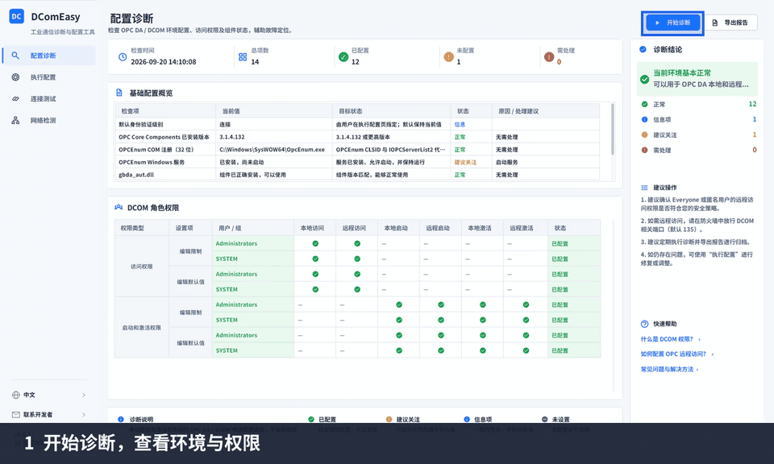

# DComEasy


<p align="center">
  <strong>简体中文</strong> · <a href="README.en.md">English</a>
</p>

<p align="center">
  <a href="https://github.com/Todayos/DComEasy-Releases/releases/latest"><strong>下载最新版本</strong></a>
  · <a href="docs/usage.md">使用指南</a>
  · <a href="https://github.com/Todayos/DComEasy-Releases/issues">问题反馈</a>
</p>

DComEasy 是面向工业现场部署、调试和维护的 Windows OPC DA / DCOM 配置与诊断工具。它将环境诊断、DCOM 权限配置、OPC DA 连接测试、点位监控、网络检测和诊断报告集中在一个界面中。

> [!IMPORTANT]
> DComEasy 是专有软件。本仓库仅用于官方版本发布、用户文档和问题反馈，不包含产品源代码。下载或使用软件即表示你同意发布包中附带的许可条款。

## 使用效果

从配置诊断开始，查看授权与版本功能，验证或创建 OPC 用户，预览并执行配置，再测试连接、读取点位并开启批量刷新。演示使用示例数据，不包含真实账号、激活码或服务器信息。

<p align="center">
  
</p>

## 核心功能

-  **配置诊断**：查看本机基础配置、运行用户、DCOM 角色权限、OPC 组件及注册状态。
-  **用户管理**：验证或创建本地 OPC 用户；已存在用户的密码不会被覆盖或重置。
-  **执行配置**：按需调整 DCOM 权限、默认身份验证级别和协议顺序；可独立预览变更，确认后再执行。
-  **组件部署**：按需安装或修复 OPC 运行环境，确保 OPCEnum 和自动化组件可用。
-  **连接测试**：无需先诊断或执行配置，使用指定 OPC 用户测试连接；支持 ProgID / CLSID，显示网络检查、失败阶段、错误码和原始错误。
-  **节点与监控**：分层展开目录、按完整 ItemID 查询；右键读取一次、设置单点或批量刷新间隔，显示值、质量、时间戳和读取错误。
-  **连接历史**：保存成功与失败记录，重启后回显最近的目标参数；右键回填或删除记录，删除保留滚动位置，历史不保存密码。
-  **网络检测**：远程目标仅显示目标连通性；检测本机时额外显示本机监听及防火墙规则。支持批量添加本机 TCP / UDP 入站端口规则。
-  **诊断报告**：导出 PDF 或 HTML，便于现场交付、问题排查和归档。
-  **双语界面**：支持简体中文与英文，可在侧栏切换并保留选择。

## 离线授权

客户端始终启用离线授权体系，不依赖官网或现场联网。所有正式发布版本都使用该授权体系；未激活时为 Free 基础版，输入有效激活码后按授权类型启用 Pro 或企业版功能。

| 类型 | 激活要求 | 当前功能范围 |
|---|---|---|
| Free | 无激活码，客户端默认状态 | 配置诊断、用户验证、变更预览、OPC 基础连接／浏览／单点读取、网络状态检查、历史与日志；PDF 带 Free 水印 |
| Pro | 32 位 Pro 激活码 | 全部功能，PDF／HTML 报告无水印 |
| Enterprise | 32 位企业版激活码 | 当前与 Pro 相同，但使用独立权限集合，便于后续分别调整 |

激活码由 8 组、每组 4 个字符组成，并包含授权类型、唯一授权编号、首次激活截止日期、可选的使用到期日期及申请信息摘要。首次激活截止日期只限制新设备首次激活；已激活设备继续按照使用到期日期校验。

## 系统要求

- 支持 64 位 Windows；DComEasy 以 32 位进程运行，以兼容 OPC DA 及相关 COM 组件。
- 使用管理员权限安装和运行 DComEasy。
- 使用完整的离线安装包；安装包已包含所需的 .NET 运行时。
- 连接测试需要可访问的 OPC DA 服务器及该环境下有效的 OPC 用户信息。

## 下载与安装

1. 前往 [Releases](https://github.com/Todayos/DComEasy-Releases/releases) 下载最新的 `DComEasy-Setup-v2.0.0.exe`。
2. 以管理员身份运行安装程序。
3. 从开始菜单启动 DComEasy，并按提示以管理员身份运行。

安装新版时无需先卸载旧版。关闭 DComEasy 后，以管理员身份运行新版安装包；目录页默认显示原安装位置，保留该目录即可原地升级，也可选择其他空目录。授权状态、日志、连接历史和用户自有文件会保留。

安装包来自本仓库的 GitHub Releases。请勿从不明来源下载安装包，也不要只复制安装目录中的单个 EXE 文件。

下载后可在 PowerShell 中校验安装包完整性：

```powershell
Get-FileHash .\DComEasy-Setup-v2.0.0.exe -Algorithm SHA256
```

当前正式安装包的 SHA-256 应为：

```text
4b968bfab03ea6c45d2fe4c1331e138e623a0f36d3dab076015915b5cc498a72
```

公开 SHA-256 不会泄露源码、授权密钥或激活码生成方法，它只用于确认文件未损坏或被替换。SHA-256 本身不能独立证明发布者身份；如果安装包和校验值同时被替换，比较仍可能通过，因此请只从本仓库的正式 Release 下载。安装包重新构建后校验值会变化，应以对应 Release 公布的值为准。

更详细的操作步骤见[使用指南](docs/usage.md)。

## 问题反馈

提交问题前请先搜索[现有 Issues](https://github.com/Todayos/DComEasy-Releases/issues)。如果没有相同问题，请使用对应模板提交：

- [报告问题](https://github.com/Todayos/DComEasy-Releases/issues/new?template=bug_report.yml)
- [提出功能建议](https://github.com/Todayos/DComEasy-Releases/issues/new?template=feature_request.yml)

问题报告中请提供 DComEasy 版本、Windows 版本、复现步骤、预期结果和实际结果。上传截图或日志前，请移除账号、主机名、IP 地址和其他敏感信息；请勿提交密码。

## 版权与许可

Copyright © 2026 Todayos. All rights reserved.

DComEasy 为专有软件。所有正式发布版本均启用离线授权机制；未激活时仅提供 Free 基础功能，Pro 和企业版功能必须使用有效激活码。本仓库公开可见不代表授予源码修改、转售或再分发权利。软件的具体使用条件以发布包中附带的许可条款为准；第三方组件适用其各自的许可条款。
