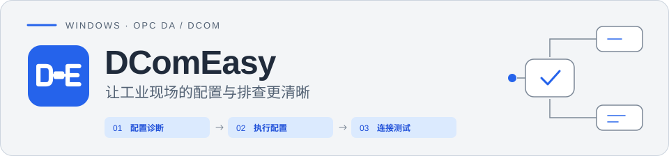

# DComEasy

  <strong>简体中文</strong> · <a href="README.en.md">English</a>

  <a href="https://github.com/Todayos/DComEasy-Releases/releases/latest"><strong>下载最新版本</strong></a>
  · <a href="docs/usage.md">使用指南</a>
  · <a href="https://github.com/Todayos/DComEasy-Releases/issues">问题反馈</a>

DComEasy 是面向工业现场部署、调试和维护的 Windows OPC DA / DCOM 配置与诊断工具。它将环境诊断、DCOM 权限配置、OPC DA 连接测试、点位监控、网络检测和诊断报告集中在一个界面中。

> [!IMPORTANT]
> DComEasy 是专有软件。本仓库仅用于官方版本发布、用户文档和问题反馈，不包含产品源代码。下载或使用软件即表示你同意发布包中附带的许可条款。

## 核心功能

-  **配置诊断**：查看本机基础配置、运行用户、DCOM 角色权限、OPC 组件及注册状态。
-  **用户管理**：验证或创建本地 OPC 用户；已存在用户的密码不会被覆盖或重置。
-  **执行配置**：按需调整 DCOM 权限、默认身份验证级别和协议顺序；可独立预览变更，确认后再执行。
-  **组件部署**：按需安装或修复 OPC 运行环境，确保 OPCEnum 和自动化组件可用。
-  **连接测试**：无需先诊断或执行配置，使用指定 OPC 用户测试连接；支持 ProgID / CLSID，显示网络检查、失败阶段、错误码和原始错误。
-  **节点与监控**：分层展开目录、按完整 ItemID 查询；右键读取一次、设置单点或批量刷新间隔，显示值、质量、时间戳和读取错误。
-  **连接历史**：保存成功与失败记录，重启后回显最近的目标参数；右键回填或删除记录，删除保留滚动位置，历史不保存密码。
-  **网络检测**：远程目标仅显示目标连通性；检测本机时额外显示本机监听及防火墙规则。支持批量添加本机 TCP / UDP 入站端口规则。
-  **诊断报告**：导出 PDF 或 HTML，便于现场交付、问题排查和归档。
-  **双语界面**：支持简体中文与英文，可在侧栏切换并保留选择。

## 界面预览

### 配置诊断

运行诊断后集中查看 OPC 组件、DCOM 权限和协议状态，并根据诊断结论继续排查。

### 执行配置

验证 OPC 用户后预览待执行的配置规则，确认 DCOM 权限、身份验证级别和协议变更后再执行。

### 连接成功与节点浏览

### 单次读取

选择一个点位执行“读取一次”，显示当前值、质量和服务器时间戳，不会自动开启定时刷新。

### 批量定时刷新

勾选多个点位后，可以统一设置刷新间隔。下图中两个点位均按 5 秒间隔刷新。

## 版本功能对比

> 免费基础版可直接使用。专业版通过离线 16 位激活码启用，授权截止时间由签发时确定。

| 功能 | 免费基础版 | 专业版 |
| --- | --- | --- |
| 配置诊断、DCOM 权限及组件状态查看 | 开放 | 开放 |
| 本地 OPC 用户验证 | 开放 | 开放 |
| 配置变更预览 | 开放 | 开放 |
| OPC DA 基础连接测试 | 开放 | 开放 |
| OPC 节点浏览和完整点名查询 | 开放 | 开放 |
| 单个点位读取一次 | 开放 | 开放 |
| 网络、端口和防火墙状态检查 | 开放 | 开放 |
| 连接历史、日志、错误详情和中英文界面 | 开放 | 开放 |
| PDF 诊断报告 | 带免费版水印 | 无水印 |
| 创建本地 OPC 用户 | — | 开放 |
| 执行 DCOM 配置 | — | 开放 |
| 移除已有 DCOM 权限 | — | 开放 |
| OPC 运行环境安装与修复 | — | 开放 |
| 单个点位持续刷新 | — | 开放 |
| 批量点位监控 | — | 开放 |
| 自动添加防火墙规则 | — | 开放 |
| HTML 诊断报告 | — | 无水印 |

## 1 个月专业版免费试用

可通过邮件申请 DComEasy 专业版免费试用 1 个月。请在软件“授权”页面复制本机标识，然后按照[免费试用申请说明与邮件模板](docs/free-trial.md)提交申请。

## 系统要求

- 支持 64 位 Windows；DComEasy 以 32 位进程运行，以兼容 OPC DA 及相关 COM 组件。
- 使用管理员权限安装和运行 DComEasy。
- 使用完整的离线安装包；安装包已包含所需的 .NET 运行时。
- 连接测试需要可访问的 OPC DA 服务器及该环境下有效的 OPC 用户信息。

## 下载与安装

1. 前往 [Releases](https://github.com/Todayos/DComEasy-Releases/releases) 下载最新的 `DComEasy-Setup-v1.0.0.exe`。
2. 以管理员身份运行安装程序。
3. 从开始菜单启动 DComEasy，并按提示以管理员身份运行。

安装包来自本仓库的 GitHub Releases。请勿从不明来源下载安装包，也不要只复制安装目录中的单个 EXE 文件。

更详细的操作步骤见[使用指南](docs/usage.md)。

## 问题反馈

提交问题前请先搜索[现有 Issues](https://github.com/Todayos/DComEasy-Releases/issues)。如果没有相同问题，请使用对应模板提交：

- [报告问题](https://github.com/Todayos/DComEasy-Releases/issues/new?template=bug_report.yml)
- [提出功能建议](https://github.com/Todayos/DComEasy-Releases/issues/new?template=feature_request.yml)

问题报告中请提供 DComEasy 版本、Windows 版本、复现步骤、预期结果和实际结果。上传截图或日志前，请移除账号、主机名、IP 地址和其他敏感信息；请勿提交密码或激活码。

## 版权与许可

Copyright © 2026 Todayos. All rights reserved.

DComEasy 为专有软件。本仓库公开可见不代表授予复制、修改、重新分发、反向工程或商业使用许可。软件的具体使用条件以发布包中附带的许可条款为准；第三方组件适用其各自的许可条款。
